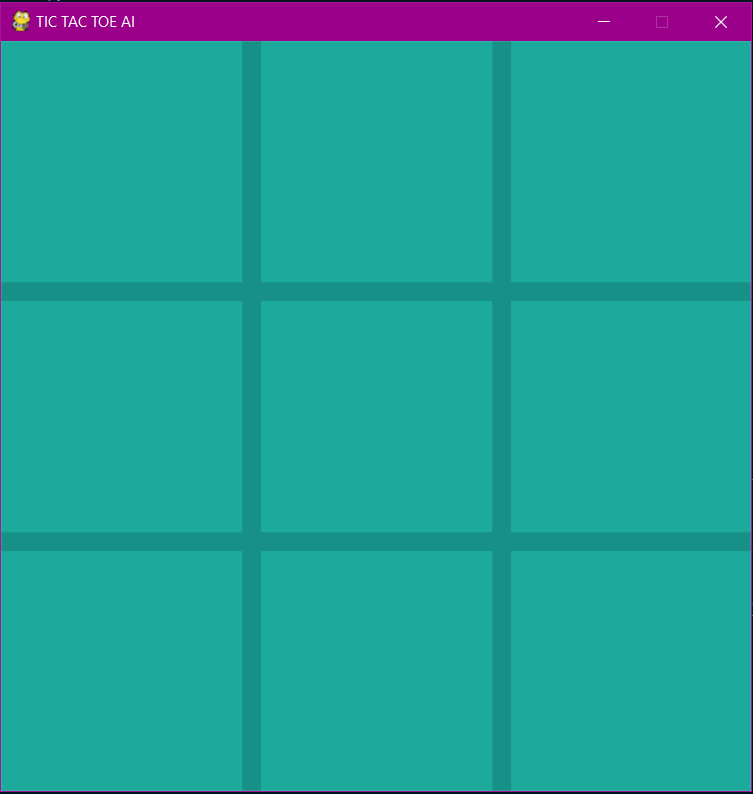

# Tic Tac Toe AI

Tic Tac Toe is a simple, classic game that has been enjoyed by people of all ages for generations. The game is played on a 3x3 grid, and the objective is to get three of your symbols (typically X or O) in a row before your opponent does. Players take turns placing their symbols on the board until one player achieves this goal, or the board is completely filled with no winner. Despite its simplicity, Tic Tac Toe can be surprisingly strategic, as players must anticipate and block their opponent's moves while also setting themselves up for victory. It is a great way to pass the time and challenge your friends or family members.

Tic Tac Toe is also known by other names such as Noughts and Crosses, Xs and Os, and Three in a Row. The game's origins can be traced back to ancient Egypt, where it was played using pebbles on a board. Nowadays, the game is usually played with pencil and paper or on a digital device.

Tic Tac Toe is not only a fun pastime, but it also has some interesting mathematical properties. For instance, there are exactly 255,168 possible games of Tic Tac Toe, but many of these games are equivalent due to symmetries and rotations. It has been proven that if both players play optimally, the game will always end in a tie. Despite this fact, Tic Tac Toe remains a popular game for children and adults alike, and many variations of the game have been created over the years to add new challenges and twists.

# Several Version

There are many variations of Tic Tac Toe that have been created over the years, some of which introduce additional rules or different board configurations to make the game more challenging or interesting. For example, some versions of the game use a 4x4 or larger grid, while others allow players to place multiple symbols on the board during their turn.

Another variation of the game is called Ultimate Tic Tac Toe, which consists of a large 9x9 grid made up of nine smaller Tic Tac Toe boards. Players take turns placing their symbols in one of the smaller boards, and the goal is to win three of the smaller boards in a row. However, there is a catch: the board in which a player makes a move determines in which smaller board their opponent must make their next move. This adds another layer of strategy to the game, as players must think carefully about their moves and how they will affect the overall board.

Overall, Tic Tac Toe is a timeless game that has entertained people for centuries. Whether played casually or competitively, it remains an enjoyable way to pass the time and challenge oneself against others.

# Game Instructions

- press 'g' to change gamemode (pvp or ai)
- press '0' to change ai level to 0 (random)
- press '1' to change ai level to 1 (impossible)
- press 'r' to restart the game

# Game Snapshots

## Snapshot 1 - Frame

## Snapshot 2 - AI Making Decision

## Snapshot 3 - Draw

# Demo Video

## Level Impossible 😲

## AI Wins 🤖 

